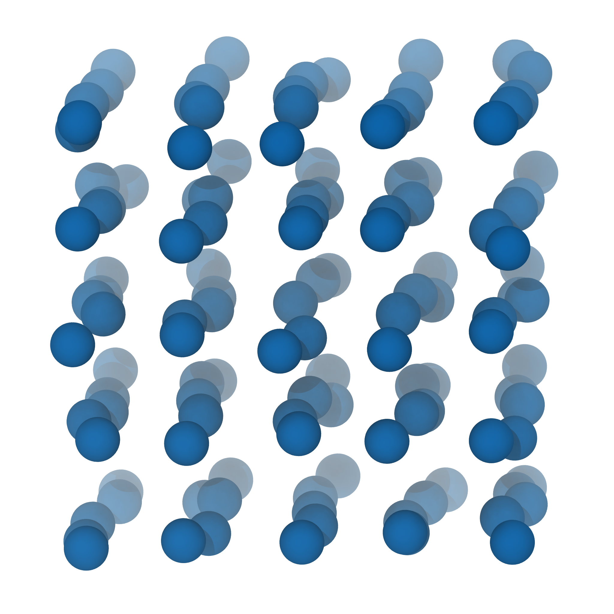

<p align="center">
  <a href="" rel="noopener">
 </a>
</p>

<h3 align="center">Molecular Dynamics Simulation of a Van der Waals Gas</h3>

<div align="center">

[]()
[](https://github.com/Eines-Informatiques-Avancades/Project-I/issues)
[](https://github.com/Eines-Informatiques-Avancades/Project-I/pulls)
[](/LICENSE)

</div>

---

<p align="center"> The main of this project is to create a simple parallel Molecular Dynamics simulation code. It is the final project of Advanced computation tools course of the Atomistic and Multiscale Computational Modelling in Physics, Chemistry and Biochemistry Master at the Universitat de Barcelona.
    <br> 
</p>

## Table of Contents

- [About](#about)
- [Getting Started](#getting_started)
- [Prerequisites](#prerequisites)
- [Installing](#installing)
- [Input parameters](#parameters)
- [Output files and plots](#output)
- [Tests](#tests)
- [Built Using](#built_using)
- [TODO](#todo)
- [Contributing](../CONTRIBUTING.md)
- [Authors](#authors)

## About <a name = "about"></a>
In this project we aim to develop a simple parallel Molecular Dynamics simulation code. We implement three possible initial structures (sc, fcc, diamond) and two initial configurations (bimodal distribution or velocities starting at 0). Additionally, we implement two different integration algorithms (the velocity verlet with and without thermostat andersen). The Lennard-Jones potential is used.

## Getting Started <a name = "getting_started"></a>

These instructions will get you a copy of the project up and running on your local machine for development and testing purposes. See [deployment](#deployment) for notes on how to deploy the project on a live system.

### Prerequisites  <a name = "prerequisites"></a>

The core of this program works in FORTRAN 90, so a FORTRAN compiler must be installed before trying to build the code. We higly reccoment to install [gfortran](https://gcc.gnu.org/wiki/GFortran). The following commands demonstrate how to install it in Ubuntu Linux:
```
sudo apt update && sudo apt install gfortran -y
```

Python is used for the results plotting and representation. A python version higher or equal than `python 3.6` is needed, and additionally the following libraries are needed:

- [numpy](https://numpy.org/)
- [matplotlib](https://matplotlib.org/)

To install these libraries, the python package manager `pip` can be used. The required versions are available from the included [requirements.txt](src/requirements.txt) file and can be easily installed using the following command while in the same directory:

```
python -m pip install -r requirements.txt
```
`pip` can normally be installed from your distribution package manager.


### Installing <a name = "installing"></a>

Donwload the zip file and uncompress in your working directory, you can use:


```
unzip Project-I-master.zip 
```

Move to main directory and run:

```
make
```

To run a simulation you must modify the parameter file, in the input directory, se the input parameter section. Since it is necessary to recompile if you want to add the changes on the input parameters, we recommend to use the command

```
make
```
or
```
make all
``` 
Nonetheless, it can be done in three steps by the following terminal commands:
```
make compile
make run
make plot
```


## Input parameters. <a name = "parameters"></a>

**If not specified, all the units are in reduced units**

- The **number of unit cells** that are simulated is chosen by the `nc` parameter 

- The **density**, set by the `density` parameter, has units of (particles / reduced units of distances), take **special care in avoiding densities greater than 0.6**.

- The **dimension** parameters can't be changed in the current version.

- Three types of lattice can be generated for the **initial structure**:
  - Simple cubic (=1),
  - Face centered cubic (=2)
  - Diamond (=3).
  - Aditionally, a read from file subroutine will be implemented in the next version.
  
  This has to be set by using the `structure` parameter.

- **Temperature** is set with the `temp` parameter and is in kelvin units.

- With the `tmelt` parameter you can decide some initial steps that will serve as **system initialization**. This represents the number of allocated time steps to melt the initial structure.

- For reproducibility you can decide a **seed for the random number** generator that are inside of the software with the `rng_seed`. Remember to be consistent with the seed you use.

- The **initial velocities** of the particles can be set up to either:
  - start at 0
  - start with bimodal distribution.

  To choose use the `vel_opt` parameter (= 1, bimodal) (= 0, zero initial velocities).

- To control the **time step** change the `dt` parameter (in ps units). Setting the dt to less than 0.01 ps will make in the simulation unstable.

- The **number of steps** that will be computed is selected in the `ntimes` parameter. 

- The **output** information frequency is controlled by the `everyt` parameter. AVOID HIGH RATES OF PRINTIN. Printing is a limiting stage in this software.

- The `rc` parameter represents the **cut-off** used during the forces calculation, at higher cut-off values better precision but higher times of calculation.

- At last, you must choose the **parameters for the force-field** ([Lennard-Jones](https://es.wikipedia.org/wiki/Potencial_de_Lennard-Jones) type):
  - `sigma`: (σ) is the distance to the zero potential point in the potential
  - `epsilon`: (ε) is the depth of the potential well.


## Output files and plots <a name = "output"></a>


Containing the initial structure:

  * `init_conf_sc.xyz`: The initial simple cubic structure is stored.
  * `init_conf_fcc.xyz`: The initial face centered cubic structure is stored.
  * `init_conf_diamond.xyz`: The initial diamond structure is stored.

Containing the thermodynamics parameters:

  * `temp.dat`: It contains the temperatures of the temperature for some time-steps.
  * `energy.dat`: It contains the energy of the temperature for some time-steps
  * `pressure.dat`: It contains the pressure of the temperature for some time-steps
  * `rdf.dat`: It contains the data of the radial distribution function.

Containing the temporal evolution:

  * `trajectory.xyz`:  It contains the trajectory of the system time evolution every given number of time steps specified in the input in a xyz format, intended to be rendered using VMD software.

The plots:
 * `ene-allplot.png`: Evolution of the kinetic, potential and total energy.
 * `ene-kinplot.png`: Evolution of the kinetic energy.
 * `ene-potplot.png`: Evolution of the potential energy.
 * `ene-totplot.png`: Evolution of the total energy.
 * `presseplot.png`: Evolution of the pressure.
 * `rdfplot.png`:  Radial distribution function.
 * `tempplot.png`: Evolution of the temperature. 

This directory also contains a [folder](./output/Helium@300K_example/) with the plots of an example consisting of the MD simulation for Helium gas at 300 K.

## Running the tests <a name = "tests"></a>

Tests will be implemented in the next version.

## Built Using <a name = "built_using"></a>

- [Fortran](https://fortran-lang.org/) - Fortran
- [Python](https://www.python.org/) - Python
- [Numpy](https://numpy.org/) - numpy module
- [Matplotlib](https://matplotlib.org/) - matplotlib module


## TODO <a name = "todo"></a>
**Parallelization:**
- Initialization:
  - sc: Raul
  - fcc: Raul
  - diamond: Marc
  - bimodal: Marc
- Thermostat:
  - kinetic: Lucas
  - andersen thermostat: Raul
- Integration:
  - euler: Pol
  - velocity verlet: Pol
  - velocity verlet with thermostat: Marc
- Forces:
  - Force + Lj: Lucas
- Statistic:
  - g(r): Pol     

## Authors <a name = "authors"></a>
- [@LucasFernandezStolpa](https://github.com/LucasFernandezStolpa) - Coordinator
- [@perasperadastra](https://github.com/perasperadastra)
- [@pol-sb](https://github.com/pol-sb)
- [@Mtunica](https://github.com/Mtunica)

See also the list of [contributors](https://github.com/Eines-Informatiques-Avancades/Project-I/contributors) who participated in this project.

