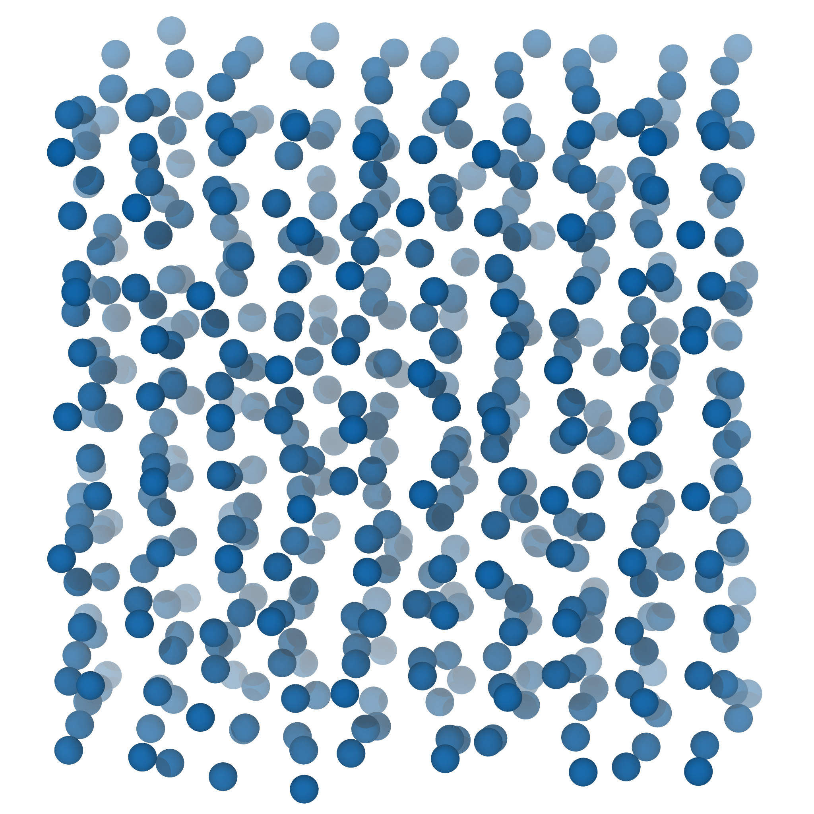

<p align="center">
  <a href="" rel="noopener">
 </a>
</p>

<h3 align="center">Molecular Dynamics Simulation of a Van der Waals Gas</h3>

<div align="center">

[]()
[](https://github.com/Eines-Informatiques-Avancades/Project-I/issues)
[](https://github.com/Eines-Informatiques-Avancades/Project-I/pulls)
[](/LICENSE)

</div>

---

<p align="center"> The main goal of this project is to create a simple parallel Molecular Dynamics simulation code. This task constitutes the final project of the Advanced Computation Tools course of the Atomistic and Multiscale Computational Modelling in Physics, Chemistry and Biochemistry Master at the Universitat de Barcelona.
    <br> 
</p>

## Table of Contents

- [About](#about)
- [Getting Started](#getting_started)
- [Prerequisites](#prerequisites)
- [Installing](#installing)
- [Input parameters](#parameters)
- [Output files and plots](#output)
- [Tests](#tests)
- [Benchmark](#benchmark)
- [Built Using](#built_using)
- [Contributing](../CONTRIBUTING.md)
- [Authors](#authors)

## About <a name = "about"></a>
In this project we aim to develop a simple parallel Molecular Dynamics simulation code. We implement three possible initial structures (sc, fcc, diamond) and two initial configurations (bimodal distribution or velocities starting at 0). Additionally, we implement two different integration algorithms (the velocity verlet with and without andersen thermostat). The Lennard-Jones potential is used as the pair interaction potential.

## Getting Started <a name = "getting_started"></a>

These instructions will get you a copy of the project up and running on your local machine for development and testing purposes.

### Prerequisites  <a name = "prerequisites"></a>

#### Fortran and MPI - Prerequisites
This program is built in Fortran90, so a Fortran compiler must be installed before trying to build the code. As this version of the code works in parallel, the program uses the OpenMPI message passing interface to send messages between processors.
In order to be able to compile and run this software, the OpenMPI library is needed, [OpenMPI](https://www.open-mpi.org/).

Additionally a Fortran compiler able to compile and link MPI programs is needed. We recommend the [mpifort](https://www.open-mpi.org/doc/v4.0/man1/mpifort.1.php) compiler, which is included in some OpenMPI distributions. The following command shows how to install OpenMPI in Ubuntu Linux:
```
sudo apt update && sudo apt install gcc gfortran openmpi-bin openmpi-common libopenmpi-dev -y
```
#### Python - Prerequisites
Furthermore, python is used for the results plotting and representation. A python version higher or equal than `python 3.6` is needed, and additionally the following libraries are needed:

- [numpy](https://numpy.org/)
- [matplotlib](https://matplotlib.org/)

To install these libraries, the python package manager `pip` can be used. The required versions are available from the included [requirements.txt](src/requirements.txt) file and can be easily installed using the following command while in the same directory:

```
python -m pip install -r requirements.txt
```
`pip` can normally be installed from your distribution package manager.


### Running a Simulation <a name = "installing"></a>

Donwload the zip file and uncompress it in your working directory, to do this, you can use:

```
unzip Project-I-master.zip 
```
Before proceeding, make sure that the [python prerequisites](#python---prerequisites) are installed in your main python distribution, or that you have activated a python virtual environment with all the requires installed
Change to the main directory and run:

```
make MPI_NPROC=n
```
Where 'n' is the number of processors that you want to use. The default is 4 processors.
In order to change any simulation settings you must modify the [parameter.h](input/parameter.h) file, in the input directory. (Please, see the [Input parameters section](#parameters)). It is necessary to recompile after any changes are made to the input parameters. After any change it is recommended to use the command:

```
make
```
or
```
make all
``` 
Alternatively, the same procedure can be done in three steps by the following terminal commands:
```
make compile
make run
make plot
```
For single processor testing, the mpirun flag `--use-hwthread-cpus` can be added when executing the makefile in order to use the hardware threads of the main cpu. For example:

```
make MPI_NPROC=8 MPI_FLAGS=--use-hwthread-cpus
```


## Input parameters. <a name = "parameters"></a>

**If not specified, all the units are in reduced units**

- The **number of unit particles** per side that are simulated is chosen by the `n` parameter 

- The **density**, set by the `density` parameter. Units in kg/m^3.

- The **dimension** parameters can't be changed in the current version.

- Three types of lattice can be generated for the **initial structure**.:
  - Simple cubic (structure=1), <p align="left">
  <a href="" rel="noopener">
  </a>
  </p>

  - Face centered cubic (structure=2) <p align="left">
  <a href="" rel="noopener">
  </a>
  </p>

  - Diamond (structure=3) <p align="left">
  <a href="" rel="noopener">
   </a>
   </p>

  - Aditionally, a read from file subroutine will be implemented in the next version.

  This has to be set by using the `structure` parameter.
  A perturbation will be applied to the positions before starting the simulation, which can be seen in the figures above.

- **Temperature** is set with the `temp` parameter and is in kelvin units.

- With the `tmelt` parameter you can decide some initial steps that will serve as **system initialization**. This represents the number of allocated time steps to melt the initial structure.

- For reproducibility you can decide a **seed for the random number** generator that are inside of the software with the `rng_seed`. Remember to be consistent with the seed you use.

- The **initial velocities** of the particles can be set up to either:
  - start at 0
  - start with bimodal distribution.

  To choose use the `vel_opt` parameter (= 1, bimodal) (= 0, zero initial velocities).

- To control the **time step** change the `dt` parameter (in ps units). Setting the dt to less than 0.01 ps will make in the simulation unstable.

- The **number of steps** that will be computed is selected in the `ntimes` parameter. 

- The **output** information frequency is controlled by the `everyt` parameter. Printing is a limiting stage in this software, avoid slowdowns by using a sufficiently large writing interval.

- At last, you must choose the **parameters for the force-field** ([Lennard-Jones](https://es.wikipedia.org/wiki/Potencial_de_Lennard-Jones) type):
  - `sigma`: (σ) is the distance to the zero potential point in the potential. Units in angstroms.
  - `epsilon`: (ε) is the depth of the potential well. Units in kelvin.


## Output files and plots <a name = "output"></a>


Containing the initial structure:

  * `init_conf_sc.xyz`: The initial simple cubic structure is stored.
  * `init_conf_fcc.xyz`: The initial face centered cubic structure is stored.
  * `init_conf_diamond.xyz`: The initial diamond structure is stored.

Containing the thermodynamics parameters:

  * `temp.dat`: It contains the temperatures of the temperature for some time-steps.
  * `energy.dat`: It contains the energy of the temperature for some time-steps
  * `pressure.dat`: It contains the pressure of the temperature for some time-steps
  * `rdf.dat`: It contains results for the radial distribution function.
  * `performance.dat`: It contains the total particle number, the number of processors and the total time of the simulation.

Containing the temporal evolution:

  * `trajectory.xyz`:  It contains the trajectory of the system time evolution every given number of time steps specified in the input in a xyz format, intended to be rendered using VMD software.

The plots:
 * `ene-allplot.png`: Evolution of the kinetic, potential and total energy.
 * `ene-kinplot.png`: Evolution of the kinetic energy.
 * `ene-potplot.png`: Evolution of the potential energy.
 * `ene-totplot.png`: Evolution of the total energy.
 * `presseplot.png`: Evolution of the pressure.
 * `rdfplot.png`:  Radial distribution function.
 * `tempplot.png`: Evolution of the temperature. 

This directory also contains a [folder](./output/Helium@300K_example/) with the plots of an example consisting of the MD simulation for Helium gas at 300 K.

## Running the tests <a name = "tests"></a>

Tests will be implemented in the next version.


### Benchmark  <a name = "benchmark"></a>

For the purpose, of maken easier to the user to decide the best parameters of a simulation, we have inglude the tool checck_parallel. This tool permits to run thorugh a selected range of processors and 125, 1000 and 10648 particles sets. The simulation always is runned for 1000 steps over all the range, but, you can choose the rest of parameters in the input file as the like any other simulation. To use the benchmark tool run the following commands, designed to run process from **MPI_minP=2** to **MPI_maxP=8** every  **MPI_stepP=2**.
```
make stats MPI_minP=2 MPI_maxP=8 MPI_stepP=2
```
Also this can be fixed modifying the top makefile of the program.
Al the information relevant to this process can be accessed in the *bench.log file*, while the data is saved the *performance.dat* file, in the results directory. In the performance file the data ara arrange in three columns, particles, processors and seconds of CPU time, respectively.

**NOTICE TO USERS**: The benchmark tool is very sensitive to the installation, check always the installation and that it runs correctly before run large simulations.

## Built Using <a name = "built_using"></a>

- [Fortran](https://fortran-lang.org/) - Fortran programming language
- [OpenMPI](https://www.open-mpi.org/) - Open Source MPI Library
- [Python](https://www.python.org/) - Python programming language
- [Numpy](https://numpy.org/) - Numerical computation module for paython
- [Matplotlib](https://matplotlib.org/) - Graphical plotting module for python

## Authors <a name = "authors"></a>
- [@LucasFernandezStolpa](https://github.com/LucasFernandezStolpa) - Coordinator
- [@perasperadastra](https://github.com/perasperadastra)
- [@pol-sb](https://github.com/pol-sb)
- [@Mtunica](https://github.com/Mtunica)

See also statistics about the [contributors](https://github.com/Eines-Informatiques-Avancades/Project-I/contributors) who participated in this project.

